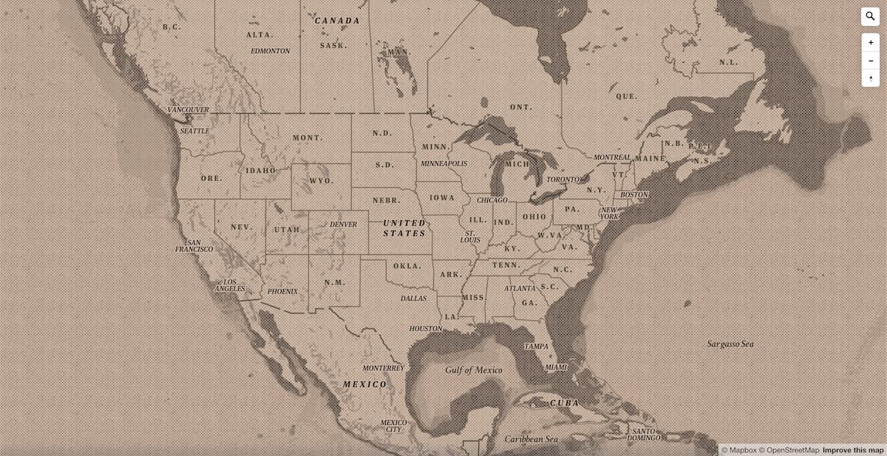

# mapbox-gl-vintage-style

Vintage map style (GL) for [Mapbox Studio](https://www.mapbox.com/mapbox-studio/)

[Live map](https://api.mapbox.com/styles/v1/mslee/cif5p01n202nisaktvljx9mv3.html?title=true&access_token=pk.eyJ1IjoibXNsZWUiLCJhIjoiclpiTWV5SSJ9.P_h8r37vD8jpIH1A6i1VRg#3.29/39.44/-93.30)

## Preview

## Usage

1. From your Mapbox Studio [Styles page](https://studio.mapbox.com/styles/), click on **Upload style**, next to the **New Style** button.
2. Select the `.json` file in this repository. Then, you should see a success message.
3. In the map editor, click on **Images** > **Upload Images** and upload each `.svg` pattern from the **_assets** folder.

Use the newly created map style's `style URL` to add it to your projects. Read more on [how to create a style](https://docs.mapbox.com/help/getting-started/map-design/#how-to-create-a-style) in the Mapbox Docs.
